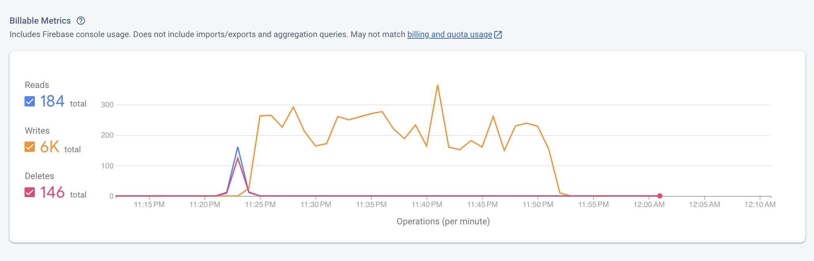
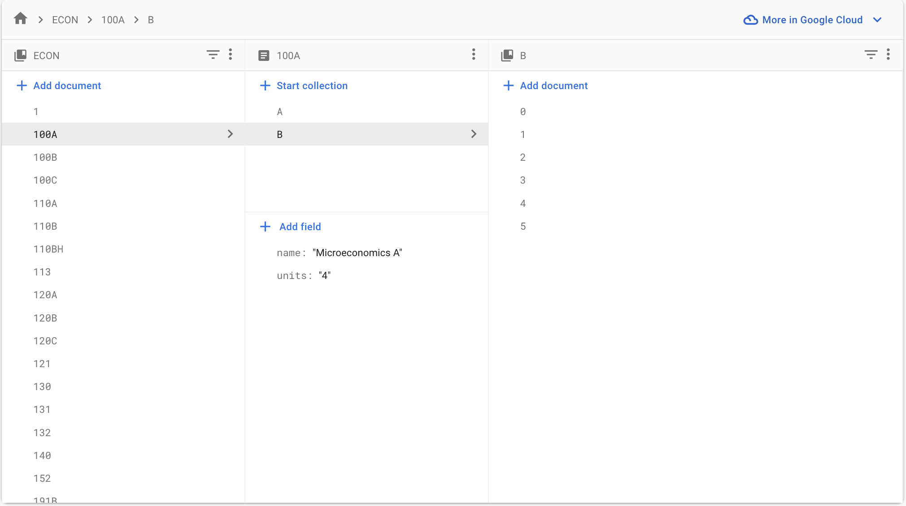

# Triton Enroll 
## Table of Contents
1. What does the Application do?
2. Limitations (And potential improvements)
3. Tech Stack
4. Database Structure
5. Parser
6. How to Run
7. About me 

## What does the Application do?
It is often tedious to add recurring events to calendar for all your classes. The purpose of Triton-enroll is to save your precious time, and helpy you be organized in college!

This web application allows you to visualize, and then subsequently download a your schedule really easily. Curently, it only creates .ics files available for download on Mac. The app is more user friendly, does not require SSO login, and (I argue) has better UI than Webreg. This website will also tell you the current waitlist counts, so if you have not enrolled already, you can access information about total/available seats in a given course. 

Find the backend for the project [here](https://github.com/charvishukla/course-scraper). 

---

## Limitations (And potential improvements)
Since the schedule of classes comes out half-way through the quarter, I update the database with new courses. I get limited storage in the free plan, which is why I am not able to populate my database with data from all possible quarters!

Here are the metrics from populating the database once (i.e. for the first time):
    

---
		
## Tech Stack:

### Backend:
- Firebase Firestore DB (see Database Structure)
	- Client-side SDK
	- Admin SDK 
- Firebase cloud functions
- Express 
- cors 
- date-fns 
- Axios 
- ical.js
- Wrote my own parser (see parser section)

### Frontend:
- React (via CRA)
	- React Big Calendar  
	- React DOM 
	- React router dom 
- CSS 
- CSS modules
- Random website where I found this cool font from: 


### Other:
- Chalk (Color Coding print statements is game changing)

---

## Database Structure:

This is the general structure:
```
    DepartmentCollection1 
	CourseDocument1
		name 
		units 
		code 
		Section SubCollection1 (Lecture)
			section name 
			instructor 
			from 
			to 
			location 
			waitlist
			totalSeats
		Section SubCollection2 (Discussion 1)
			section name 
			instructor 
			from 
			to 
			location 
			waitlist
			totalSeats
		Section SubCollection3 (Discussion 2)
			. . . 
	CourseDocument2
	CourseDocument3
	.
	.
	.
DepartmentCollection2
DepartmentCollection3
DepartmentCollection4
	. . . 
	. . .
	. . .
```

Here is what it looks like inside the project:
    

---

## Parser:

This was *the* hardest part about this project. While I was trying to fetch course data from {insert link to schedule of classes}, I realised that upon sending an POST request to UCSD's server, the response is a whole entire (poorly formatted) html page. Moreover, all the course data for a given major is not available on a singular page (rip). The website sends a GET request to fetch the next page.

I wrote two scripts in JavaScript (no, I was not able to use existing libraries to parse HTML files) to parse the HTML files to extract relevant data. And yes, this involved using getting elements by classNames, ids, iterating through 'tr' and 'td' objects in the in tables, and even using regular expressions to parse strings!

---

## How to Run 

To run the frontend, clone this repository using the following command:

```
$ git clone https://github.com/charvishukla/triton-enroll.git triton-enroll
```
This will save the project locally as `triton-enroll`. Now, navigate to the project directory and run yhe following command 

```
$ npm start 
```

You should be able to see the frontend working on `http://localhost:3001/`


Next, we will start the server. Since the backend is in a separate repository, you will have to clone the repository using the following command:

```
$ git clone https://github.com/charvishukla/course-scraper course-scraper

```

This will start the server on `http://localhost:3002/`. Now, the frontend and the backend will be able to communicate, and the app should work perfectly! 

---
## About me :

	Website: www.charvishukla.github.io
	Email: cshukla at ucsd dot edu 

Thanks for reading! Here's a pup picture to make your day! 
